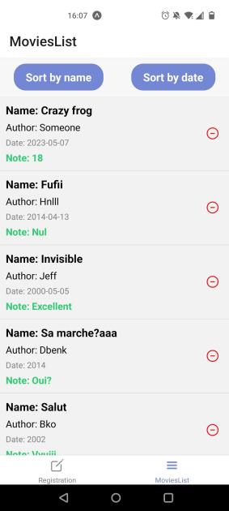

# Project Movie editor 📽
An simple application to manage your favorite movies and to keep them close to your hands.

## Installation 
📍 First clone the project 👨‍💻 

```bash
    git clone https://github.com/YoubaImkf/MovieManager.git
```

📍 do not forget to install libraries 🤭 !
```bash
   npm install @expo/vector-icons
   npm install @react-navigation/bottom-tabs
   npm install @react-navigation/native
   npm install @react-native-async-storage/async-storage
```
###  Preview 
 